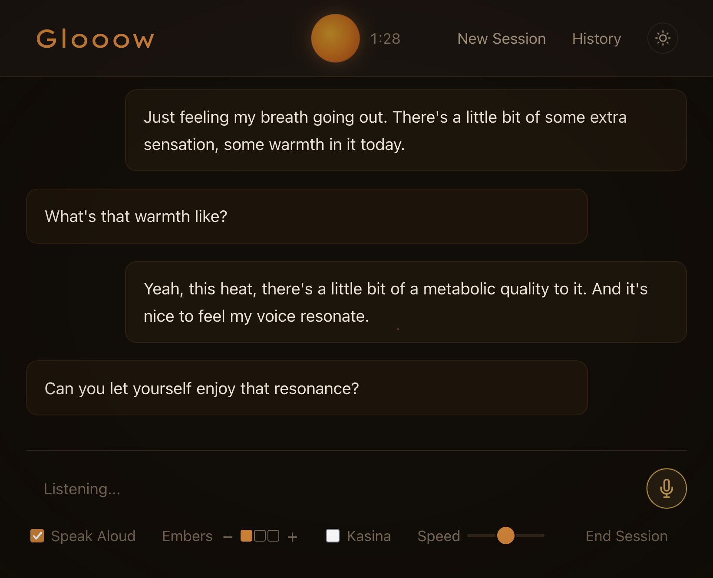

# glooow

your voice is an overpowered and underrated tool for meditation and inner work.

this is a meditation facilitator that listens and responds to your voice. it runs in your browser and uses an LLM to guide you, whisper for speech recognition, and your mic for voice input

works on macos, linux, and windows. bring your own LLM - claude subscription via CLIProxyAPI, anthropic API key, openrouter for cheap non-claude models (deepseek, kimi), or local ollama



## what it does

you start a session, optionally set an intention, pick a facilitation style, and start talking. the facilitator listens, transcribes what you say with whisper, sends it to an LLM, and speaks the response back. it can hold silence when appropriate and gently check in if you've been quiet for a while

facilitation styles range from open-ended ("what do you notice?") to somatic-focused to fully adaptive. there's a directiveness slider so you can dial in how much guidance you want

## getting started

you need:
- python 3.10+
- [uv](https://docs.astral.sh/uv/) for package management (the install script will offer to install it if missing)
- a mic
- an LLM provider (see below)

then:

```bash
git clone https://github.com/akrusz/glooow.git
cd glooow
./install.sh
./start.sh
```

the install script walks you through everything -- system deps, LLM provider choice, whisper model download. it writes your config to `config/default.yaml`

`start.sh` handles the rest: starts CLIProxyAPI if needed and launches the web server on port 5555. press **B** to open the browser, **Q** to quit

### running the server

there are a few ways to start the web server:

```bash
./start.sh           # full launcher: auto-starts CLIProxyAPI, shows config banner
./start-server.sh    # lightweight: just runs the server, nothing else
uv run python -m src.web   # direct, same as start-server.sh
```

once running, the server shows keyboard shortcuts:

| key | action |
|-----|--------|
| **B** or **Space** | open in browser |
| **Q** | quit |
| **Ctrl+C** | quit |

### windows

on windows, use PowerShell:

```powershell
git clone https://github.com/akrusz/glooow.git
cd glooow
# install uv if you haven't: irm https://astral.sh/uv/install.ps1 | iex
uv venv && uv pip install -r requirements.txt
.\start.ps1
```

set `tts.engine: browser` in `config/default.yaml`. for best voice quality, use Edge -- it has access to Microsoft's natural voices (Ava, Jenny) through speechSynthesis. Chrome and Firefox only get the basic system voices which sound more robotic

## how it works

- **audio capture** -- Web Audio API in the browser, shipped as raw PCM to the server
- **speech recognition** -- openai whisper running locally (the `small` model, ~500mb)
- **LLM** -- claude via CLIProxyAPI or anthropic API, openrouter (deepseek, kimi, etc.), openai, or local ollama
- **TTS** -- macos `say` command on mac, browser speechSynthesis on linux/windows. piper-tts is an option if you want better quality server-side audio on linux

## facilitation styles

pick one in the web UI before starting:

| style | vibe |
|---|---|
| **pleasant play** | playful exploration of pleasant sensations. understands jhana factors. encourages letting go and enjoying what's here |
| **adaptive** | flows with whatever arises, no fixed framework |
| **non-directive** | pure presence. reflects and asks "what's here now?" |
| **somatic** | body-focused -- texture, temperature, movement, density |
| **open** | minimal facilitation. holds space. long silences welcome |
| **compassion** | inner compassion and parts work. notices parts that are suffering or working hard, invites care and curiosity toward them |

## configuration

everything lives in `config/default.yaml`. the install script writes this for you but here's what you can tweak:

```yaml
tts:
  engine: macos      # macos, piper, browser, elevenlabs, parakeet
  voice: "Zoe (Premium)"
  rate: 160

llm:
  provider: claude_proxy   # claude_proxy, anthropic, openrouter, openai, ollama
  model: claude-sonnet-4-5-20250929

facilitation:
  directiveness: 3   # 0-10 scale
  verbosity: low     # low, medium, high

stt:
  model: small       # tiny, base, small, medium, large
```

### LLM providers

the web UI has a provider dropdown that shows which providers are configured. unavailable ones are marked with ✘ and show what you need to do

**CLIProxyAPI** (default) -- uses your claude subscription. install via homebrew, the install script handles it

**anthropic API** -- direct API access, no proxy needed
```bash
export ANTHROPIC_API_KEY=sk-ant-...
```
then select "Anthropic (API Key)" in the web UI, or set `llm.provider: anthropic` in config

**openrouter** -- access deepseek, kimi, and other models at low cost
```bash
export OPENROUTER_API_KEY=sk-or-...
```
then select "OpenRouter" in the web UI, or set `llm.provider: openrouter` in config. default model is DeepSeek V3.2

**openai** -- set `OPENAI_API_KEY` and `llm.provider: openai`. supports custom base URLs via `llm.openai_base_url` for any OpenAI-compatible endpoint

**ollama** -- fully local, no API key needed. install from [ollama.ai](https://ollama.ai), then pull a model:
```bash
ollama pull llama3
```
select "Ollama (Local)" in the web UI — the model dropdown auto-populates with your pulled models. or set `llm.provider: ollama` in config

## cli mode

there's also a CLI version for hands-free sessions:

```bash
uv run python -m src
```

uses your mic directly via sounddevice and speaks responses through the system TTS. press ctrl-c to end

## tips

- the theme toggle in the top right follows your system preference by default, or just click it
- if speech recognition feels slow, try `stt.model: base` (faster, less accurate)
- on linux without piper, TTS falls back to browser speechSynthesis automatically
- sessions auto-save to `sessions/` as JSON and plain text
- say something like "hold on a bit" during a session to enter silence mode. say anything to come back - it understands intent
- set an intention loosely or not at all. the facilitator holds it lightly
- click the orb in the nav bar to enter kasina gazing mode. click away from it to exit

## project layout

```
src/
  web/          flask + socketio app, templates, JS
  tts/          text-to-speech engines (macos, piper, parakeet, elevenlabs)
  stt/          whisper speech-to-text
  llm/          LLM provider abstraction
  facilitation/ prompt building, session management
  audio/        CLI audio capture + VAD
config/         default.yaml
sessions/       saved transcripts
install.sh      first-time setup
start.sh        full launcher (macOS/linux) — auto-starts proxy, shows config
start-server.sh lightweight launcher — just the web server
start.ps1       full launcher (windows)
```
